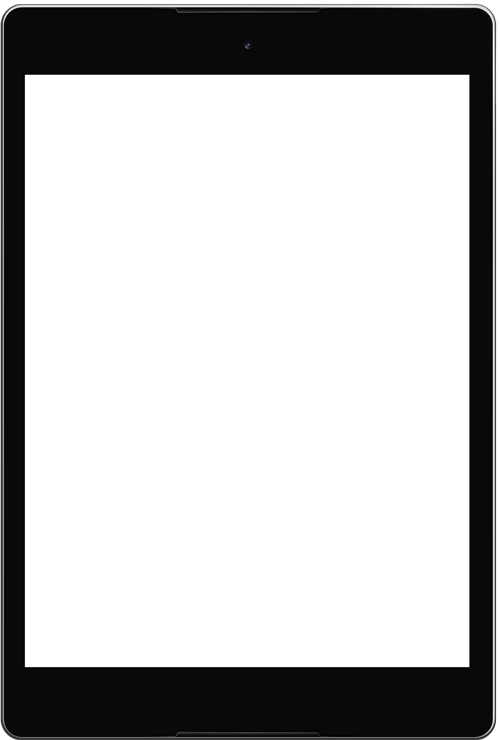

# feature-list
This is a great plugin for showing your product features dynamically.

## Getting Started

You need to call `featureList()` on an container element, with any selector, you like to intialize the plugin.

View [Demo](https://smshakil.github.io/feature-list/)

#### npm installation

$ npm install feature-list

### Prerequisites

Feature-List depends on `jQuery`.

```
// css styles

<link rel="stylesheet" href="css/bootstrap.min.css">  // This is optional. Use only for better grid and responsiveness.
<link rel="stylesheet" href="css/icofont.min.css">   // We have used icofont as our default icon set. You may like to use 'fontawesome' or other.
<link rel="stylesheet" href="css/feature-list.css">

// Js files

<script src="js/jquery-2.2.4.min.js"></script>
<script src="js/bootstrap.min.js"></script>  // This is optional. Use only for better grid and responsiveness.
<script src="js/feature-list.min.js"></script>
```

### HTML Markup

```
<div class="featureList">
  
  
    <!-- use your preferred icon set -->
    
  <i class="icofont icofont-hat-alt featureIcon activeFeatureIcon"></i>
  <i class="icofont icofont-trophy-alt featureIcon"></i>
  .................
</div>
```
```
<div class="featureDetails activeDetails">
  <p>
    Any element you want to show- Image, Text, Icon etc.
  </p>
</div>
<div class="featureDetails">
  <p>
    Just style it in your own way.
  </p>
</div>
..................
```

### CSS Styling

Upto six icons and details are styled. If you want to use more or less, style it in your own way.


### Installing

A step by step series of examples that tell you How to Install

Simple installation

```
$('.featureList').featureList()
```

Or, with options

```
$('.featureList').featureList({
  iconBackground: "rgba(0,0,0,0.1)",
  speed: 3000
});
```


## Options

```
iconColor: Hex/rgb/rgba/color-name,  //Type-'string', default-'#404040'
iconSize: px/em/rem/vh/vw/vmin/vmax,  //Type-'string'/number, default-'80px'
iconPadding: px/em/rem/vh/vw/vmin/vmax,  //Type-'string'/number, default-'10px'
iconBackground: Hex/rgb/rgba/color-name,  //Type-'string', default-'transparent'
speed: milliseconds  //Type-number, default-'5000'
```


## Contributing

Feel free for submitting pull requests to me.

## Authors

* **S.M. Shakil** - *Initial work* - [S.M.Shakil](https://github.com/smShakil)

## License

This project is licensed under the MIT License - see the [LICENSE.md](LICENSE.md) file for details
